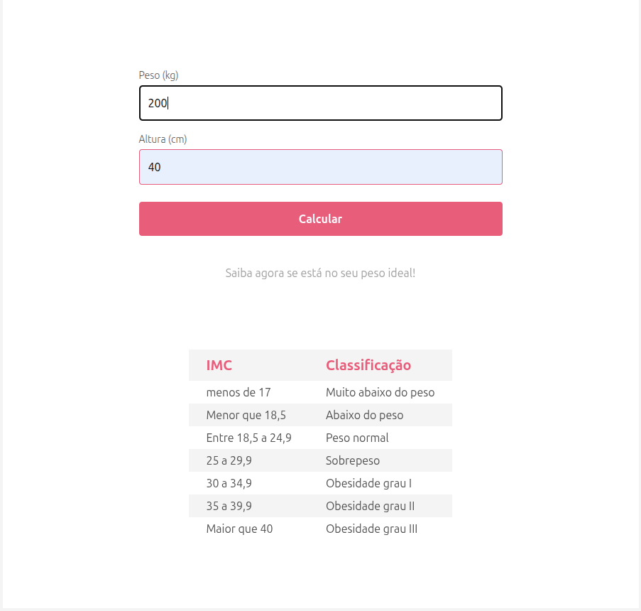
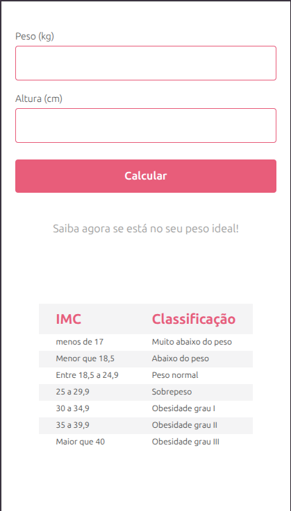
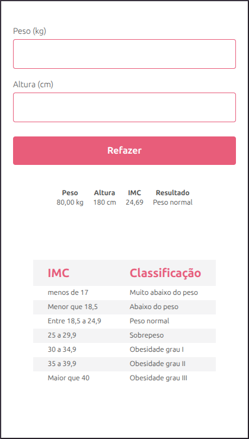
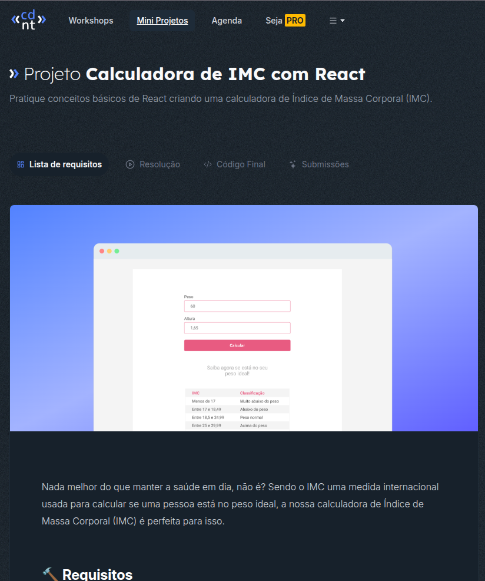

# Calculadora para calcular o Índice de Massa Corporal(IMC)

### Inserindo o peso e altura ela te retorna em qual classificação você está.

#### Desktop

 

#### Mobile

## 🛠️ Tecnologias

- React
- Typescript
- TailwindCss
    

# Mini projeto feito da plataforma Codante.

   

## Links:

Projeto: <a href="https://projeto-calculadora-eelmfe35p-netomendes21s-projects.vercel.app">Caculador-IMC</a>

Plataforma Codante: <a href="https://codante.io/mini-projetos/calculadora-de-imc-com-react" target="_blank">Codante</a>

